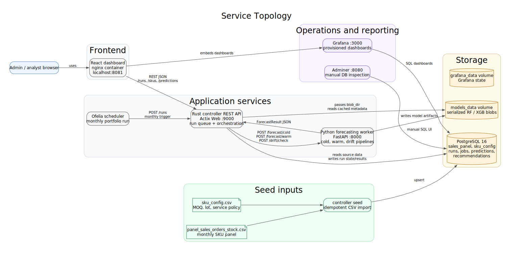
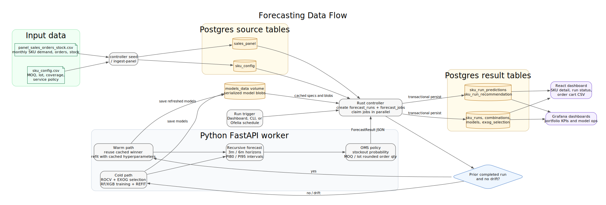

# Report Diagrams

These one-off diagrams describe the deployed service topology and the end-to-end forecasting data flow. Each diagram is available in three formats:

- `.svg` for direct insertion into a report.
- `.mmd` for Mermaid-compatible Markdown tools.
- `.dot` for Graphviz editing or re-rendering.

## Service Topology

Source files:

- [`docs/diagrams/service_topology.svg`](diagrams/service_topology.svg)
- [`docs/diagrams/service_topology.mmd`](diagrams/service_topology.mmd)
- [`docs/diagrams/service_topology.dot`](diagrams/service_topology.dot)

## Forecasting Data Flow

Source files:

- [`docs/diagrams/data_flow.svg`](diagrams/data_flow.svg)
- [`docs/diagrams/data_flow.mmd`](diagrams/data_flow.mmd)
- [`docs/diagrams/data_flow.dot`](diagrams/data_flow.dot)
